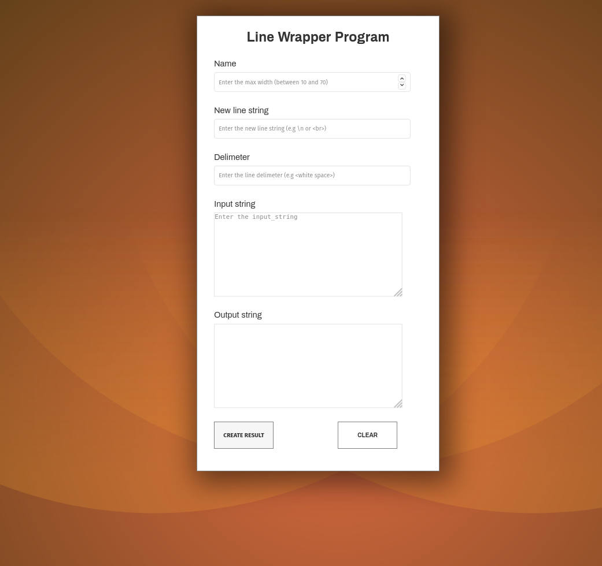
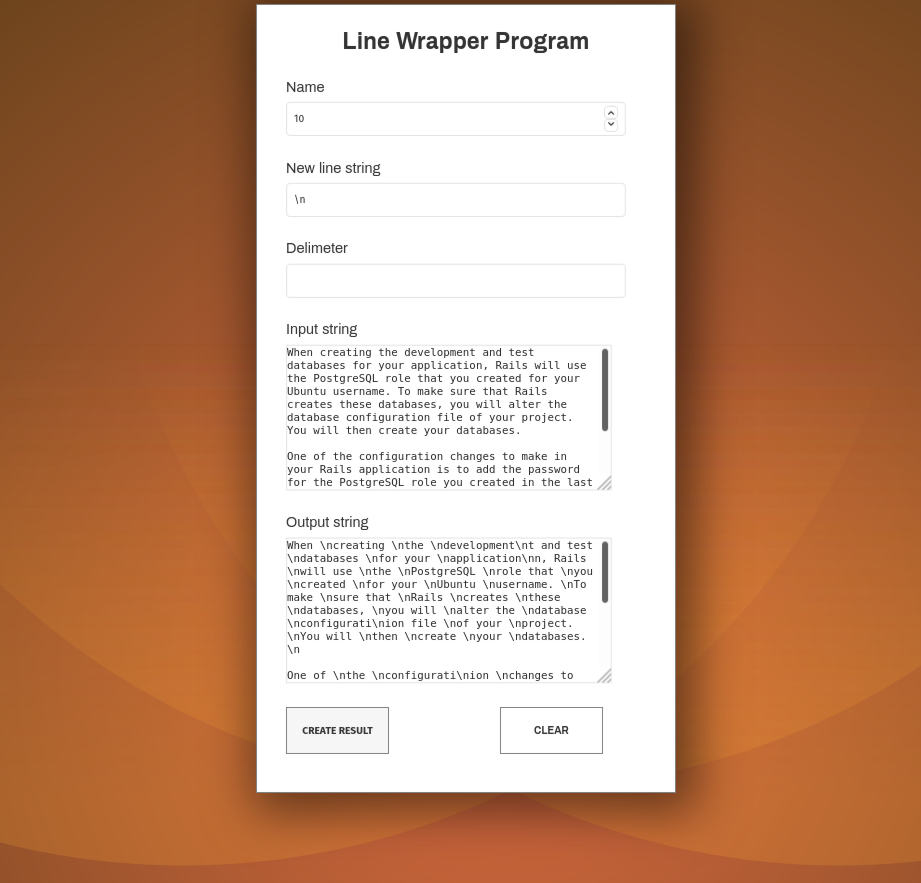

<p align="center">  </p>
<p align="center">
</p>
<p align="center"> LineWrapper is a web application for inserting new lines or breakpoints into long form text</p>

<!-- TABLE OF CONTENTS -->
## Table of Contents

* [About the Project](#about-the-project)
  * [About](#about)
  * [Screenshots](#screenshots)
* [Getting Started](#getting-started)
    * [Requirements](#requirements)
    * [Linux Development Setup](#linux-development-setup)
    * [Docker Setup](#docker-setup)
    * [App Structure](#app-structure)
* [Tests](#tests)
* [License](#license)

## About the Project
LineWrapper is a web application for inserting newlines or breakpoints into long form text.
It is built with Ruby on Rails with Postgres as the datastore.

### Screenshots
|   | 
|:---:|:---:|

### Usage
1. Max width: Also known as the maximum line length. This is the maximum length you want
your output to have. It accepts numbers only. For example, setting the max width to 50 ensures every line has a maximum of 50 characters.
2. New line String. The new line string represents the character or group of characters that you would like to serve as the breakpoint of every line. For example, for HTML documents, you can use <br> as the new line string. Regular programming languages like python, java and ruby accepts '\n' as newlines. 
3. Delimeter. The delimeter indicates which character you would like to serve as a word seperator in your input. For example, in a given string like "Hello there", the default delimiter is the white space character between 'Hello" and "word". 
4.Input String. The input string is the line or string you would like to convert into a wrapped format. 
   
To use the program, simply fill in these fields and click create result.

## Getting Started

### Requirements
The following programs are required to run this application:
- Ruby 2.7.2 
- Postgresql 11.0 +
- Rails 6.1.3

### Linux Development Setup
To clone and run this application, you'll need [Git](https://git-scm.com).

```bash
#1. Clone this repository
$ git clone git@github.com:ovieu/LineWrapper.git 
or
$ git clone https://github.com/ovieu/LineWrapper.git

# Go into the repository
$2. cd linewrapper

#3. Install dependencies
$ bundle 

#4. Update Javascript dependencies
$ yarn install --check-files

#5. Setup the database
$ rails db:create
$ rails db:schema:load
$ rails db:seed

#6. Run the app
$ rails server
```

## Docker Setup

### set environment

1. Create your `app.env` file from the example file: `cp .env.app.testing app.env`
```
POSTGRES_HOST=db
PGUSER=postgres
PGPASSWORD=postgres
RAILS_ENV=development
```

2. Create your `db.env` file from the example file: `cp .env.db.testing db.env`
```
POSTGRES_USER=postgres
POSTGRES_PASSWORD=postgres
POSTGRES_DB=rails_blog_dev
```

### starting the application
3. On the command line, run the following commainds:
```
$ docker-compose build
$ docker-compose up
$ docker-compose run web bundle exec rails db:migrate:reset
```

### reset the database
4. Reset the database by running the commands below:
```
$ docker-compose up db
$ docker-compose run web bundle exec rails db:migrate:reset
```

### App Structure
LineWrapper is a small app. You only need two files - app/services/linewrapper and the lineWrapper controller found in the controller directory. The linewrapper service object handles the line formatting while the controller forwards all recevied requests to the linewrapper.

The frontend is designed and built with HTML & SASS. The stylesheets are found in the app/assets/stylesheets directory. 
## Tests
To run the tests, use the command below. 
```bash
#1. Clone this repository
$ rails test 
```

## License
This software is released under the [MIT License](http://www.opensource.org/licenses/MIT).
